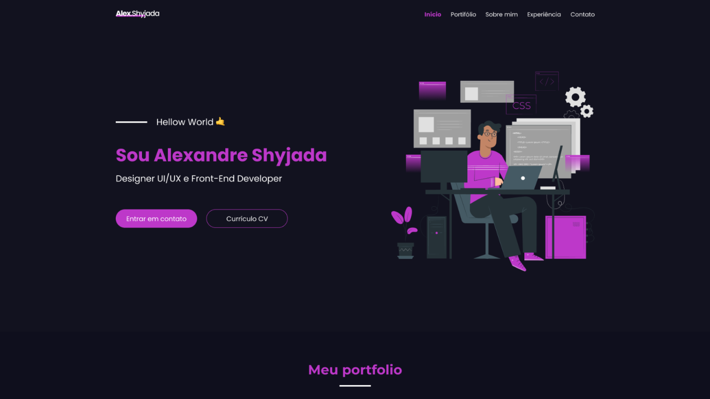

## My portfolio v2

Esse projeto é literalmente o meu primeiro projeto completo e funcional e teve a função de ser meu primeeiro portfólio. Utilizei esse projeto para me candidatar as primeiras vaga em UI/UX Design e Desenvolvimento Web Front-end.

---

## Preview

<p align="center"></p>

---

## Tecnologias

- [HTML](https://developer.mozilla.org/pt-BR/docs/Web/HTML)
- [CSS](https://developer.mozilla.org/pt-BR/docs/Web/CSS)
- [Javascript](https://developer.mozilla.org/pt-BR/docs/Web/Javascript)

---

### **Iniciando o projeto**

```bash
# Apenas abra o projeto no seu navegador pelo arquivo index.html
# Nenhuma tecnologia é necessária para rodar o projeto, apenas um bom navegador de internet

```

---

Feito por [Alexandre Shyjada](https://www.alexshyjada.com/) 😎
